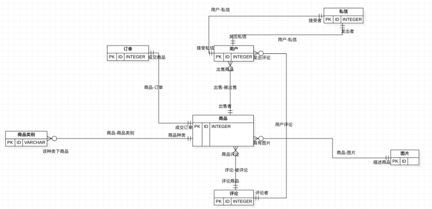

# buaaExchange前端设计文档
### 一.网页主体
1. 大体框架
2. 登录
> 账号：userName（数字字母下划线 1-10位）
> 
> 密码：password（^(?![0-9a-z]+$)(?![0-9A-Z]+$)(?![a-zA-Z]+$)[0-9A-Za-z]{6,20}$）
> 
> 
```
 # 登录post头：
 {
   "type": "login",
   "userName": "userName",
   "password": "password"
 }
```
3. 注册
> 账号：userName（数字字母下划线 1-10位）
> 
> 密码：password（^(?![0-9a-z]+$)(?![0-9A-Z]+$)(?![a-zA-Z]+$)[0-9A-Za-z]{6,20}$）
> 
> 性别：gender
> 
> 年级：grade
> 
> 校区：district
> 
> 电话：tel
```angular2html
 # 注册post头：
{
   "type": "register",
   "userName": "userName",
   "password": "password",
   "gender": "gender",
   "grade": "grade",
   "district": "district",
   "tel": "tel"
}
```


